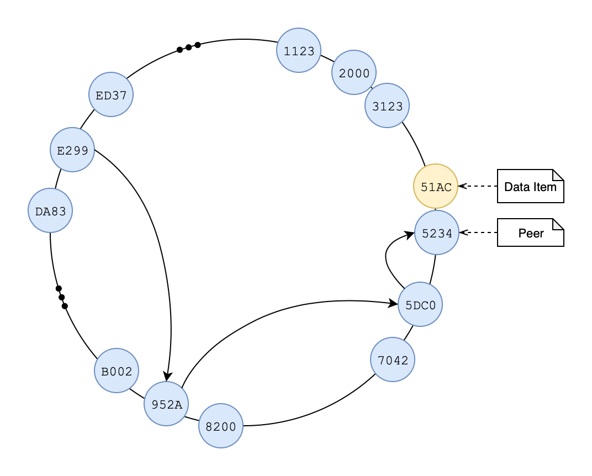

# Distributed Computing

**Pastry Peer to Peer Network**

Pastry is a comprehensive, scalable and efficient architecture for peer-to-peer applications. Peers within Pastry are self organizing, with assigned 16-bit identifiers, and form a decentralized logical overlay. Construction of such results in a deterministic and efficient routing algorithm. Lookup requests leverage a leaf set and distributed hash table (DHT) at each peer to ensure messages are delivered in *O(log N)* hops.

## Architecture

There are three fundamental components within this application, including:
* *Peer* responsible for routing requests and managing files. There can be about 64,000 peers in the system at a given moment.
* *Store* contacts a random peer to transfer data into and out of the network.
* *Discovery* maintains information about the list of peers in the system. This simplifies the process of discovering the first peer that will be the entry point into the system. There will be only one instance of the discovery node.



## System Invocation

### Configuration
The `conf/` directory holds the application properties and machine lists for starting up all of the chunk servers. These properties include:

```python
# Host the discovery is living on ( localhost / jackson )
discovery.host=jackson

# Port the discovery is living on
discovery.port=8189

# Set log level for the application ( INFO / DEBUG )
system.log.level=INFO

# Set the display style for the DHT ( SHORT / LONG )
system.dht.style=LONG
```

When running on a distributed environment, add or remove desired client machines to the application. Each machine should be on a new line and can all be unique or the same.

```console
vim conf/machine_list
```

It is required for a '+' character to follow the machine name, which allows for an optional Peer identifier to be set for a given node, e.g.,

```console
neptune+0001
saturn+1231
lamborghini+
little-rock+
lincoln+BCAD
```

### Execution
Gradle is used for build automation, and can be executing manually with `gradle clean; gralde build`. The application is constructed within a multi-layer package under `cs555.system`, and can be ran by invoking the JAR as follows:

```console
# Disovery startup
$ java -cp ./conf/:./build/libs/fault-tolerant-file-system.jar cs555.system.node.Discovery

# Peer startup with optional identification argument
$ java -cp ./conf/:./build/libs/fault-tolerant-file-system.jar cs555.system.node.Peer 0001

# Store invocation with optional commands
$ java -cp ./conf/:./build/libs/fault-tolerant-file-system.jar cs555.system.node.Store upload data/ /
$ 
```

#### Store Startup

An additional `store` script is provided to simplify the client interactions. Ensure that Discovery and one or many Peer's are running. Then invoke the `store` command as follow:  

```console
$ store help

$ store upload data/ /

$ store get /greta.jpeg data/
```

#### Linux
Execute the run script to start the Discovery node and Peer's specified under `conf/machine_list`.

```console
mars:fault-tolerant-file-system$ ./run.sh
```
#### MacOS
The application can be started in a development environment to run on a single machine. This is done by changing the configuration `discovery.host` to `localhost`.

Execute the script to start the Discovery node.
```console
Jasons-MacBook-Pro:fault-tolerant-file-system stock$ ./osx.sh
```

This will spawn two new terminals, one of which where the `osx.sh` script can be run again to spawn N number of tabs where Peer is instantiated.
```console
Jasons-MacBook-Pro:fault-tolerant-file-system stock$ ./osx.sh
```

Thereafter, the Store program can be invoked as mentioned above.

When developing locally, files are still stored in the `/tmp` directory, and are identified by their connection address ( host:port ) combination to provide an allusion of multiple systems.
